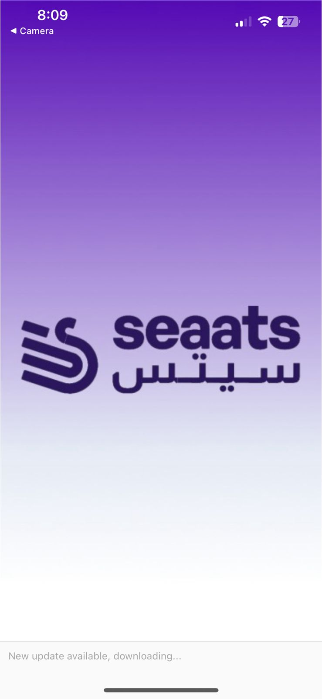
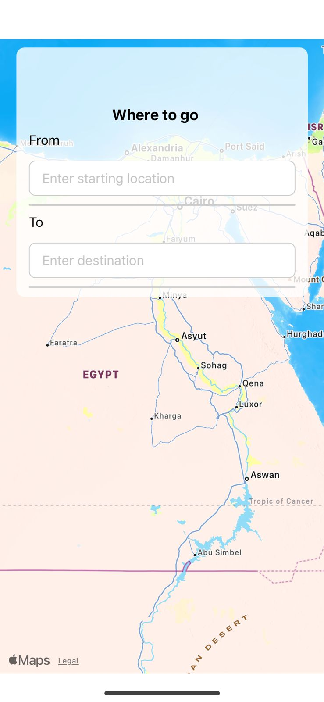
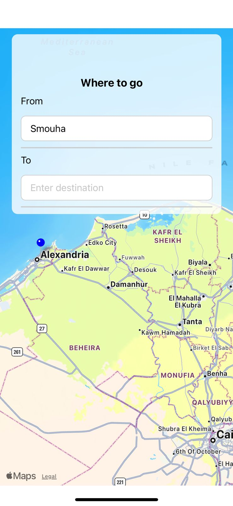
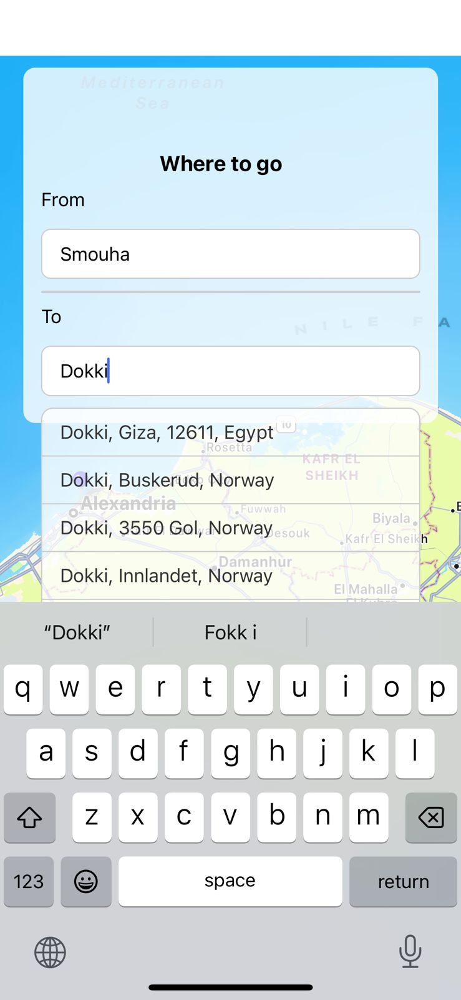
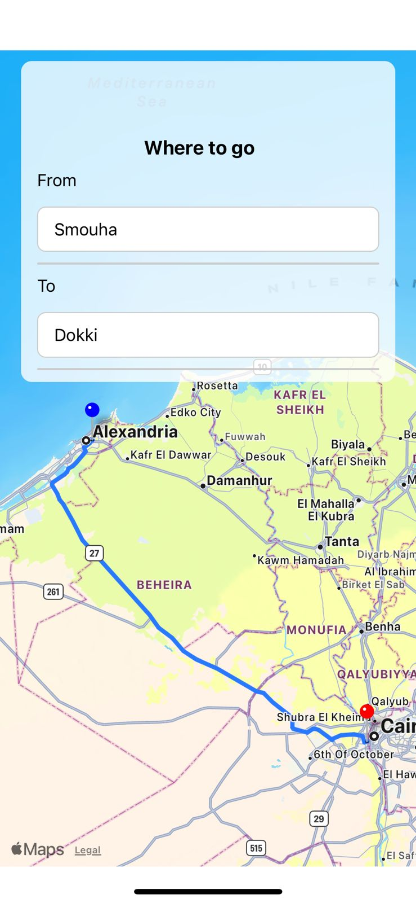
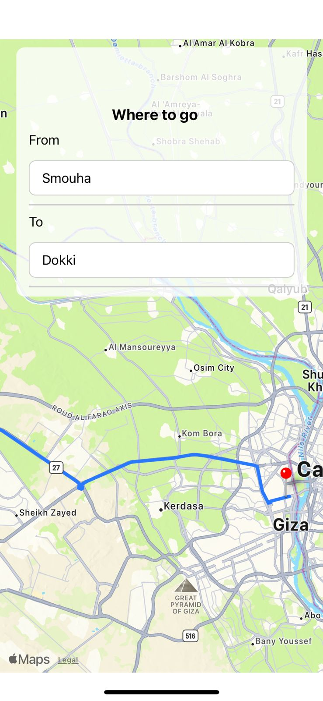

---

# Seaats

This is a React Native application that allows users to search for locations, get directions between them, and view the route on a map.

## Features

- **Search Locations**: Users can search for locations using the input fields provided.
- **Get Directions**: Once two locations are selected, the application fetches the route between them and displays it on the map.
- **View Route**: The route between the selected locations is displayed on the map using a polyline.
- **Interactive Map**: Users can interact with the map by zooming and panning to explore the route in detail.

## Technologies Used

- React Native
- React Navigation
- React Native Maps
- Mapbox Polyline
- OpenCage Geocoding API


## Screenshots

<div style="display: flex; flex-wrap: wrap;">
  <div style="flex: 33.33%; padding: 5px;">
    
    <p style="text-align: center;">Landing Page</p>
  </div>
  
  <div style="flex: 33.33%; padding: 5px;">
    
    <p style="text-align: center;">Home Screen before enter locations</p>
  </div>
  
  <div style="flex: 33.33%; padding: 5px;">
    
    <p style="text-align: center;">Search for the from location</p>
  </div>
</div>

<div style="display: flex; flex-wrap: wrap;">
  <div style="flex: 33.33%; padding: 5px;">
    
    <p style="text-align: center;">Search for destination</p>
  </div>
  
  <div style="flex: 33.33%; padding: 5px;">
    
    <p style="text-align: center;">Draw the route</p>
  </div>
  
  <div style="flex: 33.33%; padding: 5px;">
    
    <p style="text-align: center;">Zoom in for route details</p>
  </div>
</div>


## Setup Instructions

1. Clone the repository to your local machine:

   ```
   git clone <https://github.com/mahmudfathy007/Seaats.git>
   ```

2. Navigate to the project directory:

   ```
   cd seaats
   ```

3. Install dependencies:

   ```
   yarn install
   ```

4. Start the Metro bundler:

   ```
   npx expo start
   ```

## Contributing

Contributions are welcome! If you have any suggestions, enhancements, or bug fixes, please feel free to open an issue or create a pull request.


---

